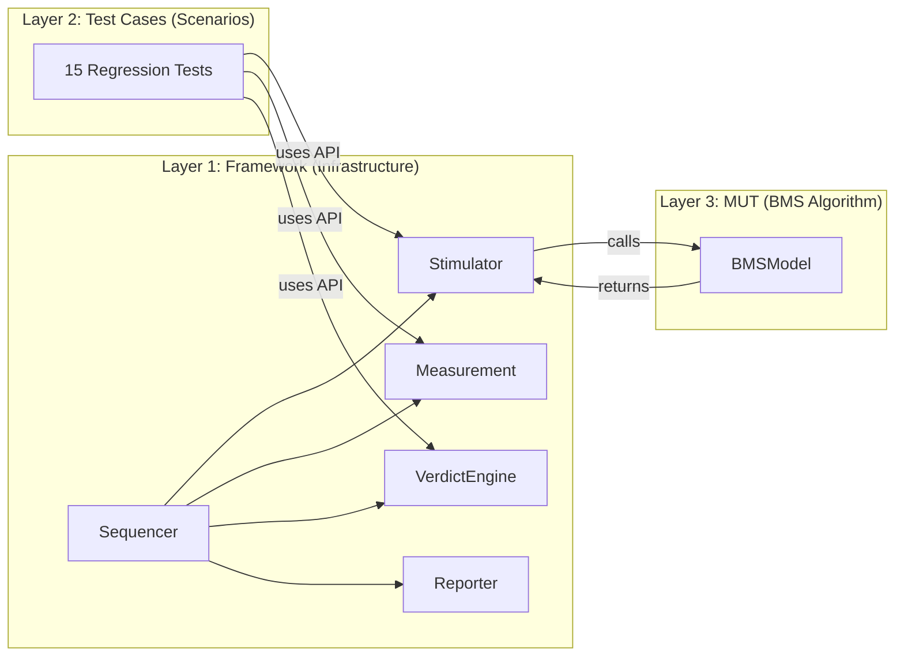
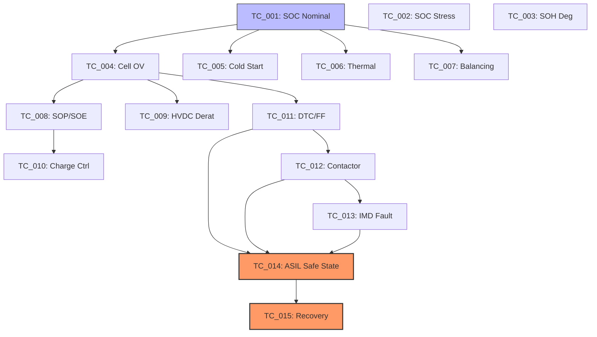

## PyMIL & PyHIL: Modular BMS Validation Framework

PyMIL-BMS is a pure Python **Model-in-the-Loop (MIL)** test automation framework designed for high-fidelity Battery Management System (BMS) validation. Built with a strict **Separation of Concerns**, it provides a scalable infrastructure for verifying complex control algorithms against automotive standards like **ASPICE SYS.4/SYS.5** and **ISO 26262**.

---

## 1. Project Vision & Methodology

In modern automotive software development, MIL testing is the first line of defense. By simulating the control logic (Model) in a virtual environment (Loop) before deploying to hardware (HIL), we drastically reduce development costs and safety risks.

### Core Principles

- **Strict Layer Separation**: Decoupling the validation engine (Layer 1) from the test scenarios (Layer 2) and the algorithm under test (Layer 3).
- **Agnostic Stimulation**: The framework interacts with the Model Under Test (MUT) via a single `step()` interface, making it entirely independent of the internal algorithm logic.
- **Traceability & Auditability**: Every verdict is logged with exact signal deltas, tolerance bands, and timestamps, producing artifacts suitable for ASPICE audits.

---

## 2. Architecture Deep Dive (The 3-Layer Holy Trinity)

The framework is organized into three completely independent layers to ensure maximum modularity.

### Layer 1: Infrastructure

- **Stimulator**: Manages the `stimulus_bus`. It supports static value injection, CSV-based profiles (like WLTP), and dynamic loops. It acts as the bridge to the MUT.
- **Measurement**: A high-performance time-series buffer. It records every input and output signal at every timestep, enabling deep post-test analysis and plotting.
- **VerdictEngine**: Implements a **Three-Zone Tolerance** system:
  - **PASS**: |Delta| ≤ Pass Tolerance (Nominal behavior).
  - **INCONCLUSIVE**: Pass Tolerance < |Delta| ≤ Warn Tolerance (Drift/Performance degradation).
  - **FAIL**: |Delta| > Warn Tolerance (Functional requirement failure).
- **Sequencer**: The campaign orchestrator. It handles dependency resolution (e.g., skip safety tests if basic monitoring fails) and dynamic class loading.
- **Reporter**: Converts execution results into a standalone, portable HTML report with embedded matplotlib visualizations (Base64 encoded PNGs).

---

## 3. BMS Algorithm Catalog (The 12 Functional Blocks)

The provided **BMSModel** (Layer 3) is a sophisticated controller organized into 12 functional blocks, each executing in a deterministic order:

### A. State Estimation Blocks

- **Block 2 - SOC/SOH Estimation**:
  - **SOC Calculation**: Uses Coulomb Counting (`SOC = SOC_init + (∫I dt / Capacity)`).
  - **OCV Correction**: Periodically "pulls" the SOC towards the Open Circuit Voltage (OCV) table when the current is low.
  - **Temp Compensation**: Scales estimated SOC by a temperature factor to account for cell impedance changes.
- **Block 5 & 6 - SOP/SOE**:
  - **SOP**: State of Power. Calculates charge/discharge limits (kW) based on SOC and Temperature derating matrices.
  - **SOE**: State of Energy. Estimates remaining range based on `Energy / Consumption_Reference`.

### B. Control & Management Blocks

- **Block 8 - Charge Control (CC/CV)**:
  - Implements a 3-state machine:
    1. **CC (Constant Current)**: Fast charging until target voltage is reached.
    2. **CV (Constant Voltage)**: Voltage clamping while current tapers off.
    3. **COMPLETE**: Termination when current drops below C-rate threshold.
- **Block 10 - Contactor & Precharge**:
  - Sequentially controls Main Positive, Main Negative, and Precharge contactors.
  - **Weld Detection**: Checks if HV bus voltage remains high after command to open.
- **Block 4 - Balancing**: Passive balancing logic that bleeds energy from the highest-voltage cells to maintain pack uniformity.

### C. Safety & Diagnostics Blocks

- **Block 9 - DTC Management**:
  - Implements a diagnostic registry with **Escalation Policy**: `PENDING` (detected once) -> `CONFIRMED` (persists for 3 steps).
  - **Freeze Frames**: Captures a snapshot of SOC, T_max, and Voltage at the exact moment a fault is confirmed.
- **Block 12 - ASIL-D Safe State**:
  - The master safety supervisor. If a critical fault (Cell OV, UV, OT, or IMD) is confirmed:
    1. Resets `SOP` to 0.0kW immediately.
    2. Force-opens Main Contactors.
    3. Triggers **Emergency Cooling**.
  - **Recovery**: Requires the fault to be physically cleared AND a `reset_requested` signal to be pulsed.

---

The project includes **15 production-ready test cases** integrated into a single regression campaign. The execution follows a structured dependency tree to ensure safety logic is only verified once basic monitoring is confirmed stable.

### Test Dependency Flow

### Critical Safety Tests

- **TC_014 - ASIL Safe State**: Verifies the **Fault Tolerance Time (FTT)**. Injects a sub-threshold UV fault and ensures the system transitions to Safe State within 300ms.
- **TC_013 - IMD Fault**: Simulates an Isolation Monitoring Device failure (high-voltage leakage to chassis) and verifies the diagnostic confirmation.
- **TC_011 - DTC Freeze Frame**: Validates the persistence of diagnostic data across state transitions.

### Continuous Integration (CI/CD)

Automated via **GitHub Actions** (`.github/workflows/regression-tests.yml`):

- Executes on every `push` or `pull_request`.
- Runs the regression suite: `python3 run_campaign.py --group regression`.
- Automatically archives HTML reports for compliance auditing.

---

## 5. Developer Guide: How to Expand

PyMIL-BMS is designed for extensibility.

1. **New Tests**: Create a `.py` file in `test_cases/`, define a `run(stim, meas, verdict)` function, and register it in `config/campaign.yaml`.
2. **New Algorithm Blocks**: Add a private method to `BMSModel` and orchestrate its execution in the `step()` method.
3. **New Stimuli**: Use `stimuli/generate_wltp_csv.py` as a template to create your own drive cycles or stress profiles.

---

_Developed as a high-fidelity reference for the "Advanced Agentic Coding" project at Google Deepmind._
