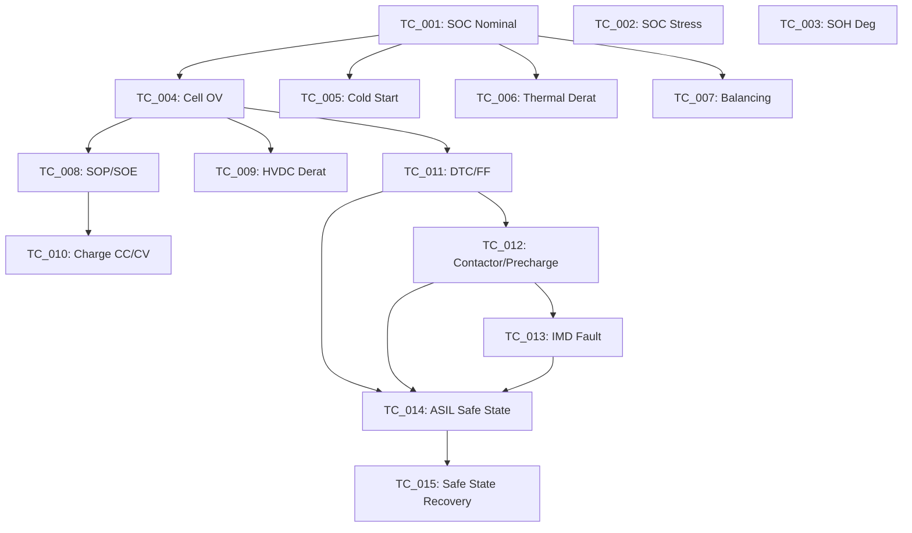

# PyXIL-BMS: MIL Test Automation Framework

PyXIL-BMS is a pure Python Model-in-the-Loop (MIL) test automation framework designed for Battery Management System (BMS) validation. It follows a strict 3-layer architecture to ensure modularity, scalability, and MUT-agnostic operation.

## 🏗️ 3-Layer Architecture

1.  **LAYER 1 — FRAMEWORK**: Core infrastructure (Stimulator, Measurement, VerdictEngine, Sequencer, Reporter). Algorithm-agnostic.
2.  **LAYER 2 — TEST CASES**: Verification scenarios implemented using the framework API. No direct imports from MUT.
3.  **LAYER 3 — MUT**: The Model Under Test (`mut/bms_model.py`). A full-featured BMS algorithm with 12 functional blocks.

## 🔋 BMS Algorithm Blocks (MUT)

The `BMSModel` implements the following logic:

- **Block 1**: Cell Monitoring (OV/UV/OT/UT faults)
- **Block 2**: SOC/SOH Estimation (Coulomb counting + OCV correction + Temp compensation)
- **Block 3**: Thermal Management & Derating
- **Block 4**: Cell Balancing (Passive/Active)
- **Block 5**: SOP (State of Power)
- **Block 6**: SOE (State of Energy)
- **Block 7**: HVDC Derating
- **Block 8**: Charge Control (CC/CV State Machine)
- **Block 9**: DTC Management (Registry + Freeze Frame)
- **Block 10**: Contactor Control (Precharge SM + Weld Detection)
- **Block 11**: Isolation Monitoring (IMD)
- **Block 12**: ASIL-D Fault Detection & Safe State

## 🚀 Test Campaign & Dependencies

The campaign consists of 15 test cases with the following dependency chain:



## 🛠️ Installation & Usage

1. **Install Dependencies**:

   ```bash
   pip3 install -r requirements.txt
   ```

2. **Run Campaign**:

   ```bash
   python3 run_campaign.py
   ```

3. **View Report**:
   The HTML report is generated in `reports/report_[timestamp].html`.

## 📊 Feature Coverage Matrix

| Feature               | Block | Test Case                      |
| :-------------------- | :---: | :----------------------------- |
| Cell Monitoring       |   1   | TC_004                         |
| SOC/SOH Estimation    |   2   | TC_001, TC_002, TC_003, TC_005 |
| Thermal Management    |   3   | TC_006                         |
| Cell Balancing        |   4   | TC_007                         |
| SOP / SOE             | 5, 6  | TC_008                         |
| HVDC Diagnostics      |   7   | TC_009                         |
| Charge Control        |   8   | TC_010                         |
| DTC & Freeze Frame    |   9   | TC_011                         |
| Contactor & Precharge |  10   | TC_012                         |
| Isolation Monitoring  |  11   | TC_013                         |
| ASIL-D Safe State     |  12   | TC_014, TC_015                 |
