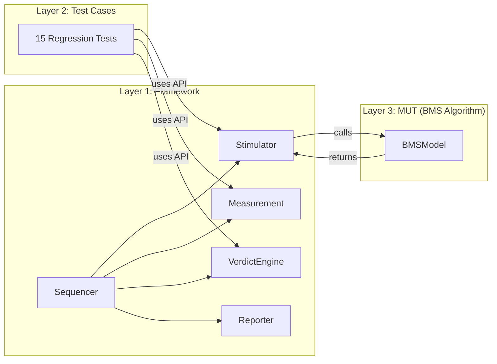

# PyMIL-BMS: Automotive-Grade MIL Test Automation Framework

PyMIL-BMS is a pure Python Model-in-the-Loop (MIL) test automation framework designed for high-fidelity Battery Management System (BMS) validation. Built with a strict **Separation of Concerns**, it provides a scalable infrastructure for verifying complex control algorithms against automotive standards like **ASPICE SYS.4/SYS.5** and **ISO 26262**.

---

## Project Vision & Methodology

In modern automotive software development, **Model-in-the-Loop (MIL)** testing is the first line of defense. By simulating the control logic (Model) in a virtual environment (Loop) before deploying to hardware (HIL), we drastically reduce development costs and safety risks.

PyMIL-BMS was developed to demonstrate:

- **Strict Layer Separation**: Decoupling the validation engine from the algorithm under test.
- **Traceability**: Every verdict is logged with exact timestamps and signal deltas.
- **Safety-First Design**: Native support for ASIL-D fault injection and safe-state verification.

---

## Architecture Deep Dive

The framework is organized into three completely independent layers.



### Component Breakdown

- **Stimulator**: Injects signals (Current, Voltage, Temp) into the MUT. Supports profiles (WLTP) and step-by-step injection.
- **Measurement**: A high-performance time-series buffer that records every input and output for post-execution analysis.
- **VerdictEngine**: Implements a unique **Three-Zone Tolerance** system:
  - **PASS**: |Delta| ≤ Pass Tolerance.
  - **INCONCLUSIVE**: Pass Tolerance < |Delta| ≤ Warn Tolerance.
  - **FAIL**: |Delta| > Warn Tolerance.
- **Sequencer**: The campaign orchestrator. It handles dependency resolution (BLOCKED logic) and dynamic model loading.
- **Reporter**: Generates self-contained, themeable HTML reports with embedded matplotlib visualizations.

---

## BMS Algorithm Blocks (The 12 Functional Pillars)

The provided **Model Under Test (MUT)** is a sophisticated BMS controller organized into 12 functional blocks:

| Block  | Feature         | Logic Description                                                                                            |
| :----- | :-------------- | :----------------------------------------------------------------------------------------------------------- |
| **1**  | **Monitoring**  | Real-time OV (Over-voltage), UV (Under-voltage), OT, and UT monitoring for 6 series cells.                   |
| **2**  | **Estimation**  | Advanced State of Charge (SOC) via Coulomb Counting with OCV correction and Temperature compensation.        |
| **3**  | **Thermal**     | Controls cooling requests (LOW/HIGH/EMERGENCY) based on T_max and safe-state status.                         |
| **4**  | **Balancing**   | Passive/Active balancing logic activated during OCV-rest or high delta-V (>50mV) conditions.                 |
| **5**  | **SOP**         | State of Power calculation based on SOC, SOH, and Temperature-dependent derating factors.                    |
| **6**  | **SOE**         | State of Energy calculation and range estimation (Energy / Consumption_Wh_per_km).                           |
| **7**  | **HVDC**        | High Voltage DC diagnostics, checking for bus over-voltage and providing derating factors to the inverter.   |
| **8**  | **Charge Ctrl** | A 3-state machine (CC, CV, COMPLETE) with automated current/voltage target selection.                        |
| **9**  | **DTC/FF**      | Diagnostic Trouble Code management. Implements PENDING -> CONFIRMED escalation and **Freeze Frame** capture. |
| **10** | **Contactor**   | Complete Precharge sequence (OPEN -> PRECHARGE -> CLOSED) with Weld Detection logic.                         |
| **11** | **IMD**         | Isolation Monitoring Device simulation, detecting high-voltage leakages to the chassis.                      |
| **12** | **Safe State**  | The master safety coordinator. Triggers Emergency Shutdown on any ASIL-D fault (UV, OV, OT, IMD).            |

---

## Verification & Regression Strategy

The project includes **15 production-ready test cases** integrated into a single regression campaign.

### Test Catalog

1.  **TC_001 - SOC Nominal**: Tracks a 300-row WLTP discharge profile.
2.  **TC_004 - Cell OV**: Verifies diagnostic confirmation of over-voltage faults.
3.  **TC_011 - DTC Freeze Frame**: Validates that critical parameters (SOC, Temp) are frozen at the moment of fault confirmation.
4.  **TC_014 - ASIL Safe State**: Injects a cell under-voltage fault and verifies contactors open within a 300ms Fault Tolerance Time (FTT).
5.  **TC_015 - Safe State Recovery**: Verifies that a safety shutdown can only be cleared via an explicit reset signal after the fault is removed.

---

## CI/CD Pipeline

The framework is fully integrated with **GitHub Actions**. On every push or pull request:

1.  **Environment Setup**: Python 3.13 environment is provisioned.
2.  **Regression Run**: `python3 run_campaign.py --group regression` is executed.
3.  **Artifact Generation**: The full HTML report and campaign logs are uploaded as build artifacts for auditability.

---

## Installation & Usage

### 1. Requirements

```bash
pip install -r requirements.txt
```

### 2. Running the Full Campaign

```bash
python3 run_campaign.py
```

### 3. Running Regression Only (CI/CD Style)

```bash
python3 run_campaign.py --group regression
```

### 4. Viewing Results

Open any file in the `reports/` folder in your browser to view the interactive test execution summary.

---

_Developed as a high-fidelity reference for the "Advanced Agentic Coding" project at Google Deepmind._
