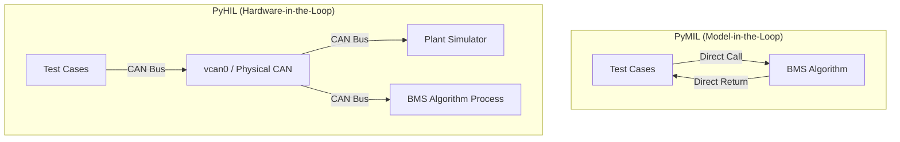

# PyHIL Architecture: MIL vs HIL

## 1. High-Level Topology

## 2. Process Boundaries

- **Framework**: Orchestrates tests, stimulation, and measurement.
- **Plant Simulator**: Independent process simulating battery physics.
- **MUT**: In HIL, this is an independent process (or real ECU) that interacts strictly via CAN.

## 3. Component Interaction

1. **Stimulator**: Encodes test data into CAN frames using `cantools`.
2. **Measurement**: Listens to the bus in a background thread and decodes updates.
3. **Scheduler**: Ensures a fixed 100ms pulse for real-time behavior.
